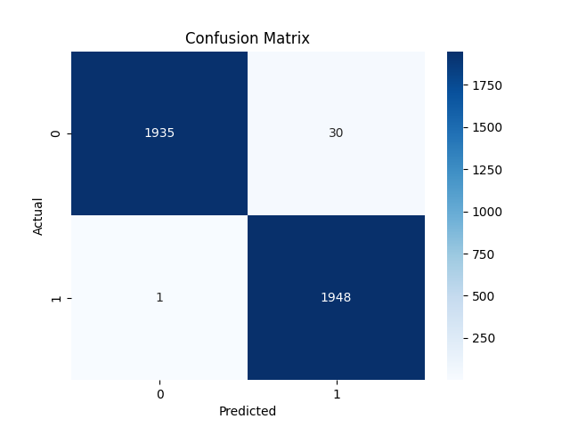
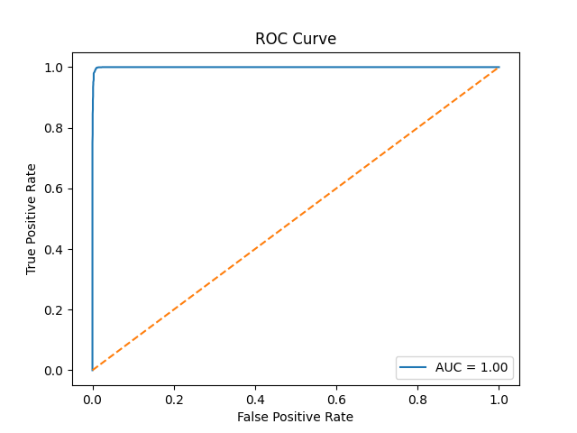
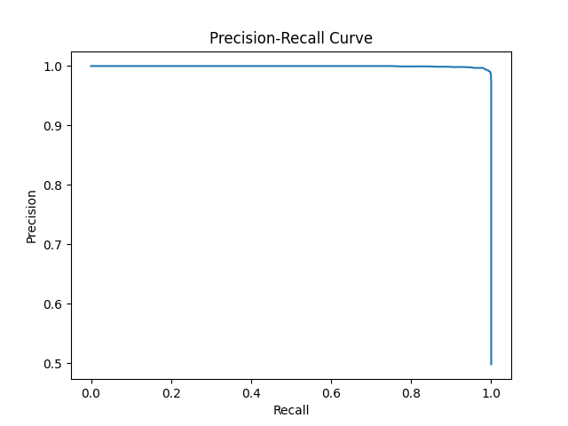
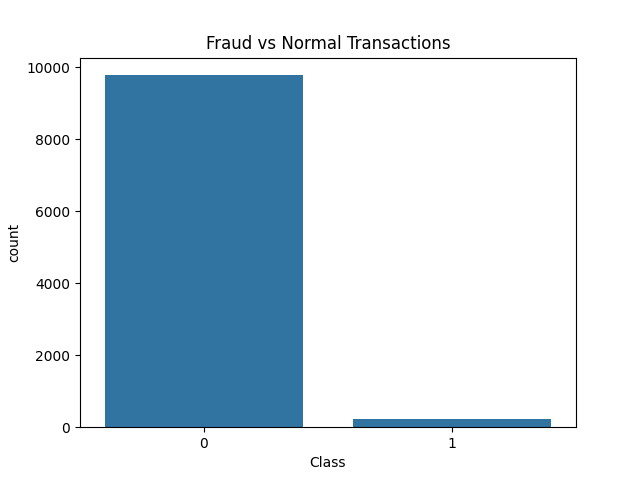

# 💳 Credit Card Fraud Detection System

> End-to-End Machine Learning System for Detecting Fraudulent Credit Card Transactions using Imbalanced Classification Techniques

---

## 🚀 Overview

Credit card fraud is a major challenge in the financial industry. Fraudulent transactions are extremely rare compared to normal transactions, making detection difficult due to **severe class imbalance**.

This project builds an **end-to-end machine learning system** that detects fraud, handles imbalance, and provides explainable results like a real fintech system.

---

## 🎯 Problem Statement

- Fraud transactions are less than 2% of total data  
- Accuracy is misleading in imbalanced datasets  
- Missing fraud (false negatives) causes financial loss  

### Goal:
Build a system that:
- Detects fraud accurately  
- Minimizes false negatives  
- Uses proper evaluation metrics (PR-AUC, ROC-AUC)  
- Generates interpretable outputs  

---

## 🧠 ML Pipeline

Data Generation → Preprocessing → Feature Engineering → SMOTE Balancing → Model Training → Evaluation → Visualization  

---

## ⚙️ Tech Stack

- Python 🐍  
- Pandas  
- NumPy  
- Scikit-learn  
- Imbalanced-learn (SMOTE)  
- Matplotlib  
- Seaborn  

---

## 🏗️ Architecture

Raw Transaction Data → Cleaning → Feature Engineering → SMOTE → Model Training → Evaluation → Fraud Prediction Output  

---

## 📁 Project Structure

Credit-Card-Fraud-Detection/  
├── data/                  # Dataset  
├── images/                # Output images  
├── models/                # Trained model  
├── notebooks/             # EDA  
├── outputs/               # Graphs & results  
├── src/                   # Core code  
├── generate_data.py       # Dataset generator  
├── main.py                # Entry point  
├── requirements.txt  
└── README.md  

---

## 📊 Evaluation Metrics

- ROC-AUC Score  
- Precision-Recall Curve  
- Confusion Matrix  
- Classification Report  

👉 These metrics are important for imbalanced datasets.

---

## 🖼️ Output Visualizations

### Confusion Matrix  


### ROC Curve  


### Precision Recall Curve  


### Class Distribution  


---

## 🧪 How to Run

### 1️⃣ Install dependencies
```bash
pip install -r requirements.txt
